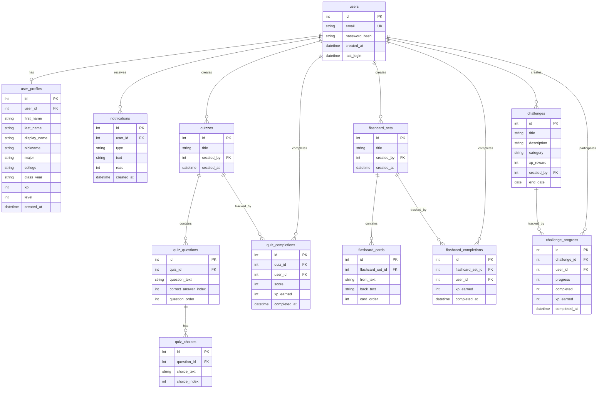

# MavPal - Complete Assignment Report Documentation
## Software Architecture, Database Design, and System Structure

---

## 📋 **TABLE OF CONTENTS**

1. [System Overview](#system-overview)
2. [Technology Stack](#technology-stack)
3. [Frontend Architecture (Component Diagram)](#frontend-architecture-component-diagram)
4. [Backend Architecture (API Structure)](#backend-architecture-api-structure)
5. [Database Schema (ER Diagram)](#database-schema-er-diagram)
6. [Data Flow Diagrams](#data-flow-diagrams)
7. [Key Design Patterns](#key-design-patterns)
8. [System Components Explained](#system-components-explained)

---

## 🎯 **SYSTEM OVERVIEW**

**MavPal** is a gamified learning platform designed for University of Texas at Arlington students. The system encourages learning through:
- **XP (Experience Points)** and **Level System**: Students earn points and level up
- **Quizzes and Flashcards**: Interactive study tools
- **Challenges**: Collaborative learning competitions
- **Leaderboards**: Competitive rankings by college, major, and class year

### **Architecture Type**
- **Frontend**: React/TypeScript (Component-Based Architecture)
- **Backend**: Node.js/Express.js (RESTful API)
- **Database**: SQLite (file-based, perfect for development)

---

## 💻 **TECHNOLOGY STACK**

### **Frontend**
- **React 18+**: UI framework
- **TypeScript**: Type-safe JavaScript
- **React Router**: Client-side routing
- **Vite**: Build tool and dev server

### **Backend**
- **Node.js**: JavaScript runtime
- **Express.js**: Web framework
- **sql.js**: SQLite database in JavaScript
- **bcryptjs**: Password hashing

### **Database**
- **SQLite**: File-based relational database
- **12 Tables**: Users, profiles, quizzes, flashcards, challenges, etc.

---

## 🏗️ **FRONTEND ARCHITECTURE (Component Diagram)**

### **Component Hierarchy Structure**

```
┌─────────────────────────────────────────────────────────┐
│                     main.tsx                             │
│              (Application Entry Point)                   │
└────────────────────┬────────────────────────────────────┘
                     │
                     ▼
┌─────────────────────────────────────────────────────────┐
│                     App.tsx                              │
│         (Root Component, Routing, Route Guards)          │
└──────┬──────────────────────────────────────┬────────────┘
       │                                      │
       ▼                                      ▼
┌─────────────────────┐          ┌──────────────────────────┐
│   AuthProvider      │          │ NotificationsProvider    │
│  (Context Provider) │          │   (Context Provider)     │
└─────────────────────┘          └──────────────────────────┘
       │                                      │
       └──────────────┬───────────────────────┘
                      │
                      ▼
┌─────────────────────────────────────────────────────────┐
│                  AppLayout.tsx                           │
│         (Navigation, Header, User Menu)                  │
└────────────────────┬────────────────────────────────────┘
                     │
         ┌───────────┼───────────┬───────────┐
         ▼           ▼           ▼           ▼
    ┌────────┐  ┌────────┐  ┌────────┐  ┌──────────┐
    │Dashboard│  │ Study  │  │Profile │  │Challenges│
    └────────┘  └────────┘  └────────┘  └──────────┘
```

### **Detailed Component Diagram (UML-Style)**


### **Component Explanation**

#### **1. Entry Point (`main.tsx`)**
- **Purpose**: Initializes React application
- **Responsibilities**:
  - Creates React root
  - Sets up BrowserRouter for navigation
  - Renders App component

#### **2. Root Component (`App.tsx`)**
- **Purpose**: Application orchestrator
- **Responsibilities**:
  - Defines all routes (`/login`, `/dashboard`, `/study`, etc.)
  - Wraps app with context providers
  - Implements `RequireAuth` route guard (protects authenticated routes)

#### **3. Context Providers**
- **`AuthProvider`**: Manages user authentication state
  - Stores user profile data
  - Handles login/logout
  - Persists to localStorage
- **`NotificationsProvider`**: Manages notification system
  - Stores notifications array
  - Tracks unread count
  - Persists to localStorage

#### **4. Layout Component (`AppLayout.tsx`)**
- **Purpose**: Consistent UI shell
- **Features**:
  - Navigation bar
  - User avatar menu
  - Notification badge
  - Renders page content via `<Outlet />`

#### **5. Page Components**
- **`Login.tsx`**: Authentication form
- **`Dashboard.tsx`**: User overview, XP progress, rankings
- **`Study.tsx`**: Quizzes and flashcards interface
- **`Profile.tsx`**: User settings and profile management
- **`Challenges.tsx`**: Challenge creation and participation
- **`Leaderboards.tsx`**: Ranking displays

---

## ⚙️ **BACKEND ARCHITECTURE (API Structure)**

### **Backend Server Structure**

```
server/
├── index.js              # Server entry point
├── db.js                 # Database initialization and wrapper
├── routes/
│   ├── auth.js          # Authentication endpoints
│   ├── users.js         # User profile endpoints
│   ├── quizzes.js       # Quiz endpoints
│   ├── flashcards.js    # Flashcard endpoints
│   ├── challenges.js    # Challenge endpoints
│   ├── notifications.js # Notification endpoints
│   └── leaderboard.js   # Leaderboard endpoints
└── utils/
    ├── levelCalculator.js # XP to level calculation
    └── migrateDatabase.js # Database migration utility
```

### **API Endpoint Diagram**


### **API Endpoints Summary**

| Endpoint | Method | Purpose | Description |
|----------|--------|---------|-------------|
| `/api/auth/register` | POST | Registration | Creates new user account |
| `/api/auth/login` | POST | Authentication | Validates credentials, returns user data |
| `/api/users/profile/:id` | GET | Get Profile | Retrieves user profile data |
| `/api/users/profile/:id` | PUT | Update Profile | Updates user profile |
| `/api/quizzes` | GET | List Quizzes | Returns all available quizzes |
| `/api/quizzes` | POST | Create Quiz | Creates a new quiz |
| `/api/quizzes/:id/complete` | POST | Complete Quiz | Records quiz completion, awards XP |
| `/api/flashcards` | GET | List Flashcards | Returns all flashcard sets |
| `/api/challenges` | GET | List Challenges | Returns all challenges |
| `/api/challenges/:id/join` | POST | Join Challenge | User joins a challenge |
| `/api/leaderboard` | GET | Leaderboard | Returns ranking data |

### **Backend Module Explanation**

#### **1. Database Module (`db.js`)**
- **Purpose**: Database connection and wrapper
- **Key Functions**:
  - `initDatabase()`: Initializes SQLite database
  - `createDatabaseWrapper()`: Creates API-compatible database wrapper
  - `saveDatabase()`: Persists database to file

#### **2. Authentication Routes (`auth.js`)**
- **Register Endpoint**:
  - Validates email format (@mavs.uta.edu)
  - Hashes password with bcrypt
  - Creates user in `users` table
  - Creates profile in `user_profiles` table
- **Login Endpoint**:
  - Validates credentials
  - Compares password hash
  - Returns user profile data

#### **3. User Routes (`users.js`)**
- **Get Profile**: Retrieves user profile with XP and level
- **Update Profile**: Updates profile information

#### **4. Quiz Routes (`quizzes.js`)**
- **List Quizzes**: Returns all quizzes
- **Create Quiz**: Creates new quiz with questions
- **Complete Quiz**: Records completion, calculates XP, updates user level

---

## 🗄️ **DATABASE SCHEMA (ER Diagram)**

### **Entity Relationship Diagram**



### **Database Tables Explained**

#### **Core User Tables**

1. **`users` Table**
   - **Purpose**: Stores authentication data
   - **Key Columns**:
     - `id`: Primary key
     - `email`: Unique identifier (must be @mavs.uta.edu)
     - `password_hash`: Bcrypt hashed password
   - **Relationships**: One-to-one with `user_profiles`

2. **`user_profiles` Table**
   - **Purpose**: Stores user profile and gamification data
   - **Key Columns**:
     - `user_id`: Foreign key to `users.id`
     - `first_name`, `last_name`: User's name
     - `xp`: Experience points (default: 0)
     - `level`: User level (default: 1)
     - `major`, `college`, `class_year`: Academic information
   - **Relationships**: One-to-one with `users`

#### **Content Tables**

3. **`quizzes` Table**
   - **Purpose**: Stores quiz definitions
   - **Key Columns**:
     - `title`: Quiz name
     - `created_by`: User who created the quiz
   - **Relationships**: 
     - One-to-many with `quiz_questions`
     - One-to-many with `quiz_completions`

4. **`quiz_questions` Table**
   - **Purpose**: Stores individual questions
   - **Key Columns**:
     - `quiz_id`: Foreign key to `quizzes`
     - `question_text`: The question
     - `correct_answer_index`: Which choice is correct (0-3)
   - **Relationships**: One-to-many with `quiz_choices`

5. **`quiz_choices` Table**
   - **Purpose**: Stores multiple choice options
   - **Key Columns**:
     - `question_id`: Foreign key to `quiz_questions`
     - `choice_text`: The choice text
     - `choice_index`: Position (0-3)

6. **`quiz_completions` Table**
   - **Purpose**: Tracks quiz completions
   - **Key Columns**:
     - `user_id`, `quiz_id`: Foreign keys
     - `score`: Score achieved
     - `xp_earned`: XP awarded
   - **Unique Constraint**: One completion per user per quiz

#### **Flashcard Tables**

7. **`flashcard_sets` Table**: Collection of flashcards
8. **`flashcard_cards` Table**: Individual flashcards
9. **`flashcard_completions` Table**: Completion tracking

#### **Challenge Tables**

10. **`challenges` Table**: Challenge definitions
11. **`challenge_progress` Table**: User progress on challenges

#### **Notification Table**

12. **`notifications` Table**: User notifications

---

## 🔄 **DATA FLOW DIAGRAMS**

### **Registration Flow**


### **Login Flow**


### **XP Award Flow**


---

## 🎨 **KEY DESIGN PATTERNS**

### **1. Context Provider Pattern**
- **Purpose**: Global state management
- **Implementation**: React Context API
- **Examples**: `AuthProvider`, `NotificationsProvider`
- **Benefits**: 
  - Avoids prop drilling
  - Centralized state management
  - Easy to access from any component

### **2. Route Guard Pattern**
- **Purpose**: Protect authenticated routes
- **Implementation**: `RequireAuth` component
- **How it works**: Checks if user is logged in, redirects to login if not

### **3. Custom Hooks Pattern**
- **Purpose**: Reusable logic
- **Examples**: `useAuth()`, `useNotifications()`
- **Benefits**: 
  - Encapsulates context access
  - Consistent API across components

### **4. Component Composition**
- **Purpose**: Build complex UIs from simple components
- **Implementation**: Layout components wrap page components
- **Example**: `AppLayout` wraps all authenticated pages

### **5. RESTful API Pattern**
- **Purpose**: Standard HTTP-based API
- **Implementation**: Express.js routes
- **Conventions**:
  - GET: Retrieve data
  - POST: Create data
  - PUT: Update data
  - DELETE: Remove data

---

## 📚 **SYSTEM COMPONENTS EXPLAINED**

### **Frontend Components**

#### **Entry Point (`main.tsx`)**
- **File**: `src/main.tsx`
- **Purpose**: Application bootstrap
- **Key Code**: 
  ```typescript
  createRoot(document.getElementById('root')!).render(
    <BrowserRouter>
      <App />
    </BrowserRouter>
  )
  ```

#### **Root Component (`App.tsx`)**
- **File**: `src/App.tsx`
- **Purpose**: Routing and context providers
- **Key Features**:
  - Route definitions
  - `RequireAuth` guard
  - Context provider wrapping

#### **Authentication (`auth.tsx`)**
- **File**: `src/auth.tsx`
- **Purpose**: User authentication state
- **Key Functions**:
  - `login()`: Validates and creates user session
  - `logout()`: Clears session
  - `updateProfile()`: Updates user data

#### **Study Page (`Study.tsx`)**
- **File**: `src/pages/Study.tsx`
- **Purpose**: Quiz and flashcard interface
- **Key Features**:
  - Quiz runner
  - Flashcard viewer
  - XP calculation
  - Daily tasks

### **Backend Components**

#### **Database Wrapper (`db.js`)**
- **File**: `server/db.js`
- **Purpose**: SQLite database interface
- **Key Functions**:
  - `initDatabase()`: Loads/creates database
  - `createDatabaseWrapper()`: Creates API wrapper
  - `saveDatabase()`: Persists changes

#### **Authentication Routes (`auth.js`)**
- **File**: `server/routes/auth.js`
- **Purpose**: Authentication endpoints
- **Endpoints**:
  - `POST /api/auth/register`: Create account
  - `POST /api/auth/login`: Authenticate user

#### **Quiz Routes (`quizzes.js`)**
- **File**: `server/routes/quizzes.js`
- **Purpose**: Quiz management
- **Endpoints**:
  - `GET /api/quizzes`: List all quizzes
  - `POST /api/quizzes`: Create quiz
  - `POST /api/quizzes/:id/complete`: Complete quiz, award XP

### **Database Schema**

#### **User Tables**
- **`users`**: Authentication data (email, password_hash)
- **`user_profiles`**: Profile and gamification data (XP, level, name)

#### **Content Tables**
- **`quizzes` → `quiz_questions` → `quiz_choices`**: Quiz structure
- **`flashcard_sets` → `flashcard_cards`**: Flashcard structure
- **`challenges`**: Challenge definitions

#### **Tracking Tables**
- **`quiz_completions`**: Quiz completion records
- **`flashcard_completions`**: Flashcard completion records
- **`challenge_progress`**: Challenge participation

---

## 📊 **SUMMARY FOR ASSIGNMENT REPORT**

### **Architecture Summary**

1. **Frontend**: React/TypeScript component-based architecture
   - Context providers for state management
   - Route-based navigation
   - Component composition pattern

2. **Backend**: Node.js/Express.js RESTful API
   - Modular route structure
   - Database abstraction layer
   - Authentication middleware

3. **Database**: SQLite relational database
   - 12 tables with proper relationships
   - Foreign key constraints
   - Indexes for performance

### **Key Features**

- ✅ User authentication (registration/login)
- ✅ XP and level system
- ✅ Quiz and flashcard system
- ✅ Challenge system
- ✅ Leaderboards
- ✅ Notifications

### **Technical Highlights**

- **Type Safety**: TypeScript throughout
- **Security**: Password hashing with bcrypt
- **Data Persistence**: SQLite database
- **State Management**: React Context API
- **Routing**: React Router with route guards

---

## 📝 **NOTES FOR ASSIGNMENT**

**Important**: This is a **JavaScript/TypeScript/React** application, NOT Java. The "class diagrams" shown are actually **component diagrams** representing React components, which serve similar purposes to classes in object-oriented programming.

- **Components** = Classes (in React paradigm)
- **Props** = Parameters
- **State** = Instance variables
- **Hooks** = Methods
- **Context** = Singleton pattern

This documentation provides all the information needed for your assignment report, including:
- ✅ Component architecture diagrams
- ✅ Database ER diagrams
- ✅ API structure diagrams
- ✅ Data flow diagrams
- ✅ Detailed explanations of each component

---

**Document Version**: 1.0  
**Last Updated**: Current Date  
**Project**: MavPal - UTA Gamification Platform

