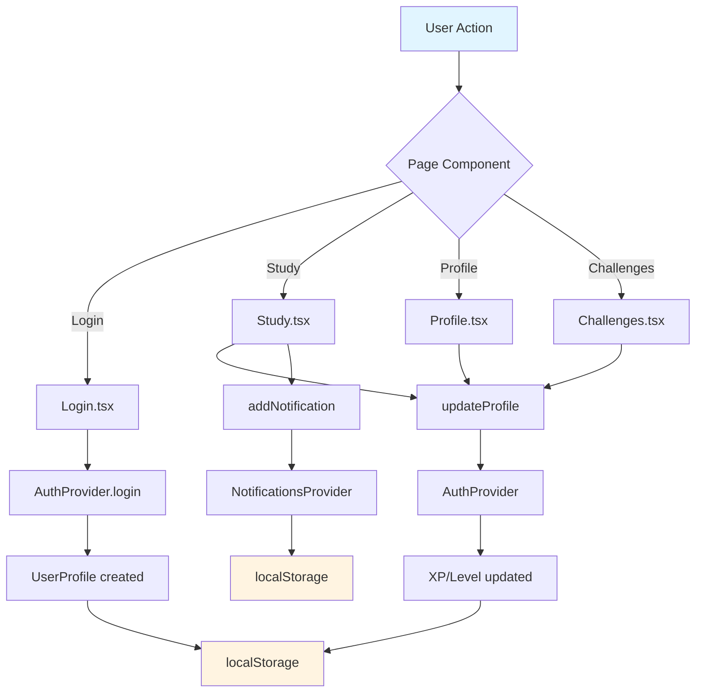

# MavPal - Class/Component Diagram
## UML-Style Component Architecture Diagram

---

## 📊 **COMPLETE CLASS DIAGRAM**

```mermaid
classDiagram
    %% Entry Point
    class main_tsx {
        +createRoot()
        +render()
        <<File: src/main.tsx:1-13>>
    }

    %% Root Application
    class App_tsx {
        +RequireAuth()
        +render()
        <<File: src/App.tsx:1-42>>
        -Routes definition: Lines 25-37
        -Route guard: Lines 15-19
    }

    %% Context Providers
    class AuthProvider {
        -user: UserProfile | null
        -STORAGE_KEY: string
        +login(email, password): Promise~string|null~
        +logout(): void
        +updateProfile(updates): void
        <<File: src/auth.tsx:26-75>>
        -State management: Line 27
        -localStorage sync: Lines 29-43
    }

    class NotificationsProvider {
        -notifications: AppNotification[]
        -STORAGE_KEY: string
        +addNotification(n): void
        +markAllRead(): void
        +clearAll(): void
        -unreadCount: number
        <<File: src/notifications.tsx:23-72>>
        -State management: Line 24
        -localStorage sync: Lines 26-39
    }

    %% Type Definitions
    class UserProfile {
        +email: string
        +displayName: string
        +nickname?: string
        +major?: string
        +college?: string
        +classYear?: string
        +avatarUrl?: string
        +xp: number
        +level: number
        <<Type: src/auth.tsx:3-13>>
    }

    class AppNotification {
        +id: string
        +type: 'Quiz' | 'Flashcards' | 'Challenge' | 'Ranking' | 'System'
        +text: string
        +createdAt: number
        +read: boolean
        <<Type: src/notifications.tsx:3-9>>
    }

    class AuthContextValue {
        +user: UserProfile | null
        +login(email, password): Promise~string|null~
        +logout(): void
        +updateProfile(updates): void
        <<Interface: src/auth.tsx:15-20>>
    }

    class NotificationsContextValue {
        +notifications: AppNotification[]
        +unreadCount: number
        +addNotification(n): void
        +markAllRead(): void
        +clearAll(): void
        <<Interface: src/notifications.tsx:11-17>>
    }

    %% Layout Components
    class AppLayout_tsx {
        -menuOpen: boolean
        -avatarRef: RefObject
        +handleLogout(): void
        +render()
        <<File: src/layouts/AppLayout.tsx:1-75>>
        -Navigation: Lines 36-42
        -User menu: Lines 54-66
        -Outlet: Line 71
    }

    %% Page Components
    class Login_tsx {
        -email: string
        -password: string
        -error: string | null
        +onSubmit(e): void
        +render()
        <<File: src/pages/Login.tsx:1-153>>
        -Form validation: Lines 13-18
        -UI: Lines 20-149
    }

    class Dashboard_tsx {
        +render()
        <<File: src/pages/Dashboard.tsx:1-162>>
        -Welcome card: Lines 7-45
        -Quick actions: Lines 47-79
        -Rankings: Lines 80-104
        -Schedule: Lines 106-158
    }

    class Profile_tsx {
        -nickname: string
        -avatarUrl: string | undefined
        -avatarEmoji: string
        -fileInputRef: RefObject
        +saveSettings(): void
        +ReadOnly(label, value): JSX
        +render()
        <<File: src/pages/Profile.tsx:1-147>>
        -Profile settings: Lines 20-84
        -Stats: Lines 86-129
        -ReadOnly component: Lines 134-141
    }

    class Study_tsx {
        -studyMode: 'quiz' | 'flashcards'
        -quizzes: Quiz[]
        -selectedQuizId: string | null
        -questionIndex: number
        -selectedChoice: number | null
        -score: number
        -quizCompleted: boolean
        -flashcardSets: FlashcardSet[]
        -selectedFlashcardId: string | null
        -cardIndex: number
        -showAnswer: boolean
        -dailyTasks: Task[]
        +startQuiz(id): void
        +startFlashcards(id): void
        +submitAnswer(): void
        +nextQuestion(): void
        +nextCard(): void
        +createQuiz(): void
        +createFlashcardSet(): void
        +markDailyTaskComplete(id): void
        +claimDailyBonus(): void
        +render()
        <<File: src/pages/Study.tsx:1-1064>>
        -Types: Lines 5-8
        -Sample data: Lines 10-54
        -State: Lines 56-110
        -Functions: Lines 112-320
        -UI sections: Lines 324-1061
    }

    class Challenges_tsx {
        -challenges: Challenge[]
        -title: string
        -desc: string
        -category: string
        -xpReward: number
        -maxProgress: number
        -activeTab: 'create' | 'join'
        +create(): void
        +joinChallenge(id): void
        +render()
        <<File: src/pages/Challenges.tsx:1-332>>
        -Challenge type: Lines 4-15
        -State: Lines 18-63
        -Functions: Lines 65-94
    }

    class Leaderboards_tsx {
        -tab: 'overall' | 'college' | 'major' | 'class' | 'friends'
        -filter: Filter
        -rows: Row[]
        +render()
        <<File: src/pages/Leaderboards.tsx:1-58>>
        -Row type: Line 3
        -Sample data: Lines 4-9
        -Filtering: Lines 15-21
    }

    class Notifications_tsx {
        +useEffect(): void
        +render()
        <<File: src/pages/Notifications.tsx:1-40>>
        -Auto-mark read: Lines 7-9
        -List display: Lines 17-25
    }

    %% Study Page Types
    class Question {
        +text: string
        +choices: string[]
        +answer: number
        <<Type: src/pages/Study.tsx:5>>
    }

    class Quiz {
        +id: string
        +title: string
        +questions: Question[]
        +completedBy?: string[]
        <<Type: src/pages/Study.tsx:6>>
    }

    class Flashcard {
        +id: string
        +front: string
        +back: string
        <<Type: src/pages/Study.tsx:7>>
    }

    class FlashcardSet {
        +id: string
        +title: string
        +cards: Flashcard[]
        +completedBy?: string[]
        <<Type: src/pages/Study.tsx:8>>
    }

    %% Challenges Page Types
    class Challenge {
        +id: number
        +title: string
        +description: string
        +progress: number
        +maxProgress: number
        +xpReward: number
        +createdBy: string
        +participants: number
        +endDate: string
        +category: string
        <<Type: src/pages/Challenges.tsx:4-15>>
    }

    class Row {
        +name: string
        +xp: number
        +major: string
        +college: string
        +classYear: string
        <<Type: src/pages/Leaderboards.tsx:3>>
    }

    %% Hooks
    class useAuth {
        +user: UserProfile | null
        +login(email, password): Promise~string|null~
        +logout(): void
        +updateProfile(updates): void
        <<Hook: src/auth.tsx:77-81>>
    }

    class useNotifications {
        +notifications: AppNotification[]
        +unreadCount: number
        +addNotification(n): void
        +markAllRead(): void
        +clearAll(): void
        <<Hook: src/notifications.tsx:74-78>>
    }

    %% Relationships
    main_tsx --> App_tsx : renders
    App_tsx --> AuthProvider : wraps with
    App_tsx --> NotificationsProvider : wraps with
    App_tsx --> AppLayout_tsx : routes to
    App_tsx --> Login_tsx : routes to
    
    AuthProvider --> UserProfile : manages
    AuthProvider --> AuthContextValue : provides
    NotificationsProvider --> AppNotification : manages
    NotificationsProvider --> NotificationsContextValue : provides
    
    AppLayout_tsx --> Dashboard_tsx : renders via Outlet
    AppLayout_tsx --> Study_tsx : renders via Outlet
    AppLayout_tsx --> Challenges_tsx : renders via Outlet
    AppLayout_tsx --> Leaderboards_tsx : renders via Outlet
    AppLayout_tsx --> Profile_tsx : renders via Outlet
    AppLayout_tsx --> Notifications_tsx : renders via Outlet
    
    AppLayout_tsx --> useAuth : uses
    AppLayout_tsx --> useNotifications : uses
    
    Login_tsx --> useAuth : uses
    Dashboard_tsx --> useAuth : uses (indirect)
    Profile_tsx --> useAuth : uses
    Study_tsx --> useAuth : uses
    Study_tsx --> useNotifications : uses
    Challenges_tsx --> useAuth : uses
    Notifications_tsx --> useNotifications : uses
    
    useAuth --> AuthProvider : accesses context
    useNotifications --> NotificationsProvider : accesses context
    
    Study_tsx --> Quiz : manages
    Study_tsx --> Question : contains
    Study_tsx --> FlashcardSet : manages
    Study_tsx --> Flashcard : contains
    Quiz --> Question : contains many
    
    Challenges_tsx --> Challenge : manages
    
    Leaderboards_tsx --> Row : displays
```



---

## 📋 **COMPONENT REFERENCE TABLE**

| Component/Type | File Location | Line Range | Purpose |
|---------------|---------------|------------|---------|
| **main.tsx** | `src/main.tsx` | 1-13 | Application entry point |
| **App.tsx** | `src/App.tsx` | 1-42 | Root component, routing |
| **RequireAuth** | `src/App.tsx` | 15-19 | Route guard component |
| **AuthProvider** | `src/auth.tsx` | 26-75 | Authentication context provider |
| **UserProfile** | `src/auth.tsx` | 3-13 | User data type |
| **AuthContextValue** | `src/auth.tsx` | 15-20 | Auth context interface |
| **useAuth** | `src/auth.tsx` | 77-81 | Auth context hook |
| **NotificationsProvider** | `src/notifications.tsx` | 23-72 | Notifications context provider |
| **AppNotification** | `src/notifications.tsx` | 3-9 | Notification data type |
| **NotificationsContextValue** | `src/notifications.tsx` | 11-17 | Notifications context interface |
| **useNotifications** | `src/notifications.tsx` | 74-78 | Notifications context hook |
| **AppLayout** | `src/layouts/AppLayout.tsx` | 1-75 | Main layout component |
| **Login** | `src/pages/Login.tsx` | 1-153 | Login page component |
| **Dashboard** | `src/pages/Dashboard.tsx` | 1-162 | Dashboard page |
| **Profile** | `src/pages/Profile.tsx` | 1-147 | Profile page |
| **ReadOnly** | `src/pages/Profile.tsx` | 134-141 | Helper component (Profile) |
| **Study** | `src/pages/Study.tsx` | 1-1064 | Study page (quizzes/flashcards) |
| **Question** | `src/pages/Study.tsx` | 5 | Quiz question type |
| **Quiz** | `src/pages/Study.tsx` | 6 | Quiz data type |
| **Flashcard** | `src/pages/Study.tsx` | 7 | Flashcard type |
| **FlashcardSet** | `src/pages/Study.tsx` | 8 | Flashcard set type |
| **Challenges** | `src/pages/Challenges.tsx` | 1-332 | Challenges page |
| **Challenge** | `src/pages/Challenges.tsx` | 4-15 | Challenge data type |
| **Leaderboards** | `src/pages/Leaderboards.tsx` | 1-58 | Leaderboards page |
| **Row** | `src/pages/Leaderboards.tsx` | 3 | Leaderboard row type |
| **Notifications** | `src/pages/Notifications.tsx` | 1-40 | Notifications page |

---

## 🔄 **DATA FLOW DIAGRAM**



---

## 🎯 **KEY RELATIONSHIPS**

1. **Composition**: App → AuthProvider, NotificationsProvider
2. **Composition**: AppLayout → All page components (via Outlet)
3. **Dependency**: Pages → useAuth, useNotifications hooks
4. **Dependency**: Hooks → Context Providers
5. **Aggregation**: Study → Quiz → Question
6. **Aggregation**: Study → FlashcardSet → Flashcard
7. **Aggregation**: Challenges → Challenge[]
8. **Aggregation**: Leaderboards → Row[]

---

## 📐 **ARCHITECTURE LAYERS**

```
┌─────────────────────────────────────┐
│   PRESENTATION LAYER                │
│   (Pages, Layouts)                  │
│   Login, Dashboard, Profile, etc.   │
└──────────────┬──────────────────────┘
               │
┌──────────────▼──────────────────────┐
│   STATE MANAGEMENT LAYER            │
│   (Context Providers, Hooks)         │
│   AuthProvider, NotificationsProvider│
└──────────────┬──────────────────────┘
               │
┌──────────────▼──────────────────────┐
│   PERSISTENCE LAYER                 │
│   (LocalStorage)                    │
│   Browser Storage                   │
└─────────────────────────────────────┘
```

---

This diagram shows the complete architecture of the MavPal application, with all components, types, and their relationships clearly mapped with line number references for easy navigation.

